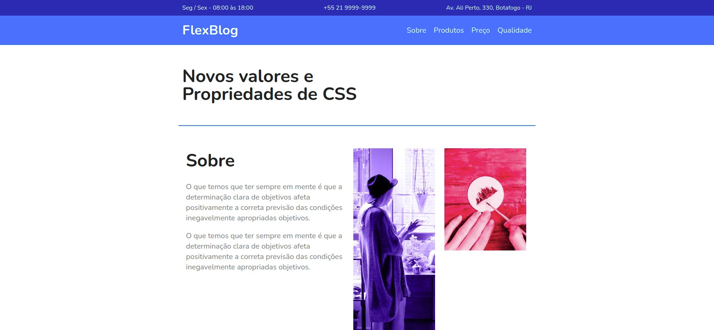
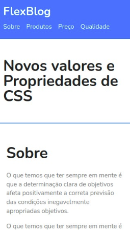

<h1 align="center">
  
</h1>

<h3 align="center">
  Curso realizado na origamid - Edu Souza o/
</h3>

<blockquote align="center">“Os melhores momentos na vida são como os arcos-íris: aparecem quando você menos espera.”</blockquote>

<h4 align="center">
  Repositório - CSS Flexbox
</h4>

 

  &nbsp;
  &nbsp;
  

  <a href="#rocket-Sobre-o-Portfólio">Sobre o curso</a>&nbsp; &nbsp; |&nbsp; &nbsp; 
  <a href="#postbox-Entrega"">Entrega</a>&nbsp; &nbsp; |&nbsp; &nbsp; 
  <a href="#unlock-Licença">Licença</a>

## :rocket: Sobre o curso

#### CSS Flexbox

No curso de CSS Flexbox você irá aprender como criar um layout responsivo no CSS utilizando apenas as propriedades do Flexbox. Assim você não precisará mais definir valores fixos e flutuar elementos para criar o seu layout.

Vamos iniciar pelos fundamentos, ensinando todas as propriedades e o que elas fazem no CSS. Após estes vamos criar um projeto real para colocarmos em prática o aprendizado.

#### Screenshots:

   &nbsp; &nbsp; 
  

## :postbox: Entrega

#### Concluido :clipboard:

Acesse o deploy do projeto [aqui](https://edusouza-programmer.github.io/css_flexbox-origamid/).

# 
## :unlock: Licença

Este projeto está licenciado sob a Licença MIT - consulte [LICENSE](https://opensource.org/licenses/MIT) para maiores detalhes.
